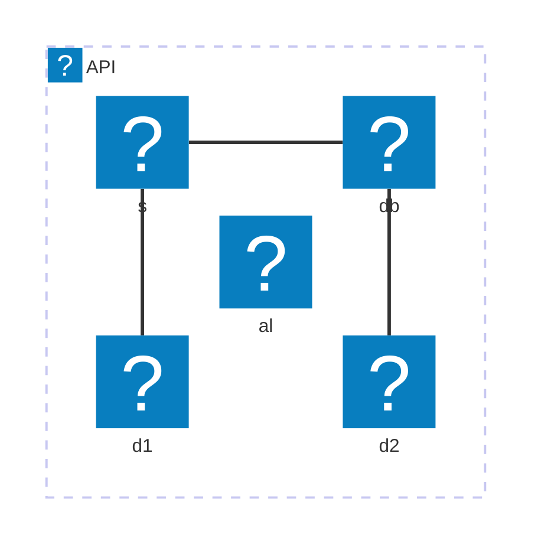

architecture test debug-test

```mermaid
architecture-beta
    group api(logos:aws-lambda)[API]

    service db(logos:aws-aurora)[db] in api
    service disk1(logos:aws-glacier)[d1] in api
    service disk2(logos:aws-s3)[d2] in api
    service server(logos:aws-ec2)[s] in api
    service alert(mdi:alert-octagram)[al] in api

    db:L -- R:server
    disk1:T -- B:server
    disk2:T -- B:db
```
