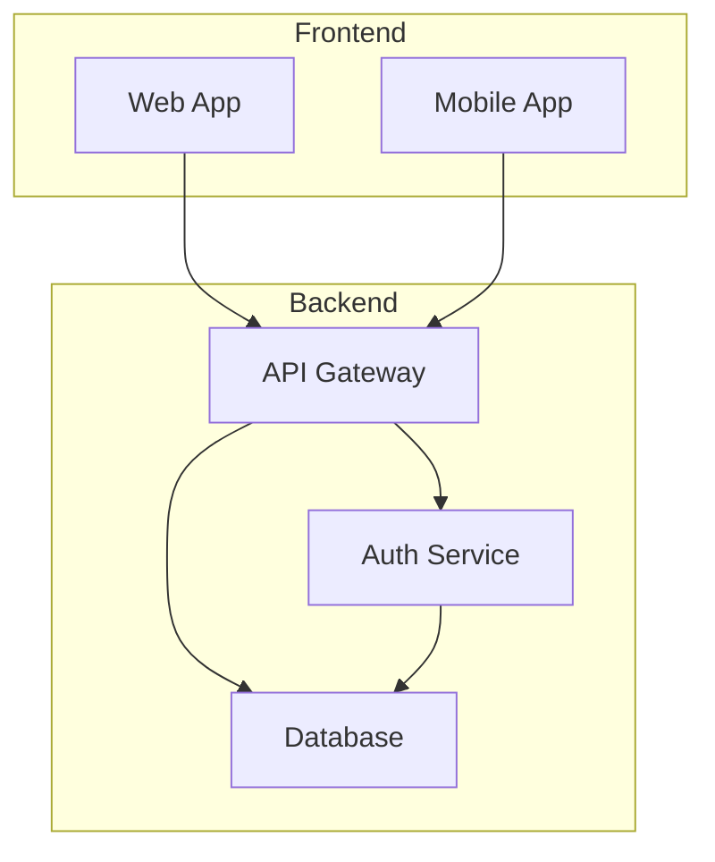

# Article 1: System Architecture

This article demonstrates a system architecture diagram in a nested directory structure.

This diagram should be rendered to `test/fixtures/articles/generated/article1-1.svg`.
