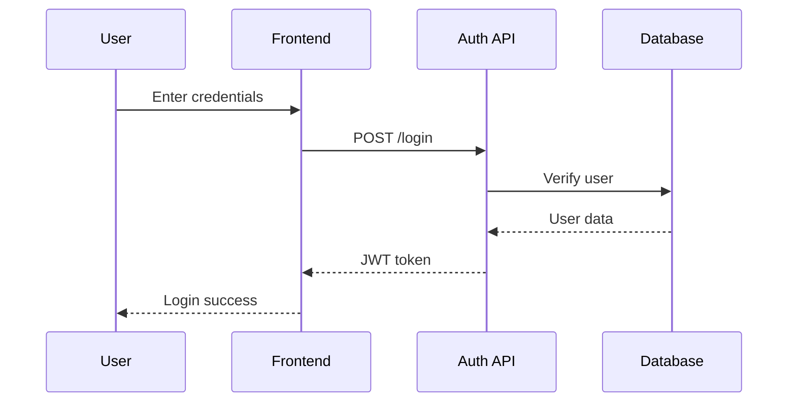
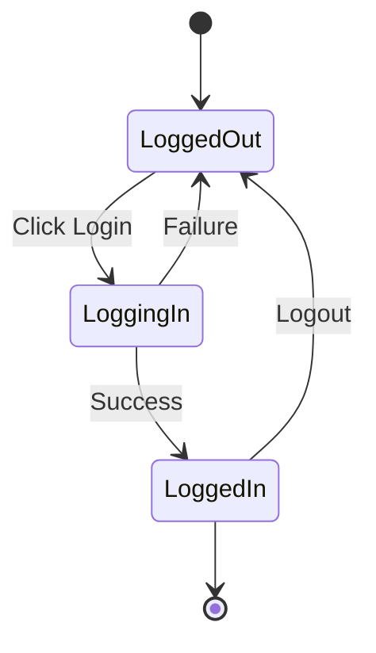

# Article 2: User Journey

This article shows a user journey with multiple diagrams.

## Login Flow

```mermaid
sequenceDiagram
    participant U as User
    participant F as Frontend
    participant A as Auth API
    participant D as Database

    U->>F: Enter credentials
    F->>A: POST /login
    A->>D: Verify user
    D-->>A: User data
    A-->>F: JWT token
    F-->>U: Login success
```

## State Machine

```mermaid
stateDiagram-v2
    [*] --> LoggedOut
    LoggedOut --> LoggingIn: Click Login
    LoggingIn --> LoggedIn: Success
    LoggingIn --> LoggedOut: Failure
    LoggedIn --> LoggedOut: Logout
    LoggedIn --> [*]
```

Both diagrams should be rendered as `article2-1.svg` and `article2-2.svg`.
